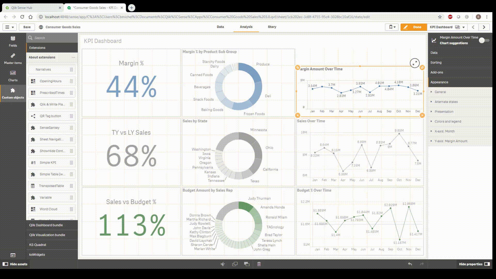

# qlik-qr-tags

This extension is based on / extending Fady Heiba's original dashboard link generator(https://github.com/fadyheiba/Dashboard-Link-Generator)! I built it on the qlik-oss repo (https://github.com/qlik-oss/Dashboard-Link-Generator).

This is an addon to the original extension, so this could theoretically be added to the current release.

The idea was that by using a mobile device like a phone or tablet scanning a QR Code is usually one of the fastest ways to navigate to a specific ressource. This led me to include a QR Code generator in the current extension build. This allows tags to be generated, that can then be printed and attached to surfaces like machines on a shopfloor, shelving in a storage unit, hospital beds, rooms, whatever physical representation of your favourite Qlik Selections you can come up with. 

So anyone who wants to see specific KPIs for a machine, shelf, patient, etc. can just scan the tag and will be directly brought to the App, Sheet and have the specific item pre selected.

# Installation

To use the Extension you can take the prebuilt version (zip file) from the `dist` folder and import it to your QMC.
For use on Desktop create a folder `qlik-qr-tags` in `%USERPROFILE%\Documents\qlik\sense\extensions\` and copy the contents from the repo `dist` folder.

To build it yourself:

Have node.js installed.

1) Clone the repo
2) run `npm i` 
3) run `npm run build` to deploy to the `dist` folder

# Credit

* Obviously Fady Heiba, since I have just nested my code in his extension
* Qlik Branch, since I assume they built the build process around the extension?

# License

Released under the MIT License

The word "QR Code" is registered trademark of:
DENSO WAVE INCORPORATED
